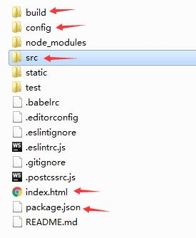
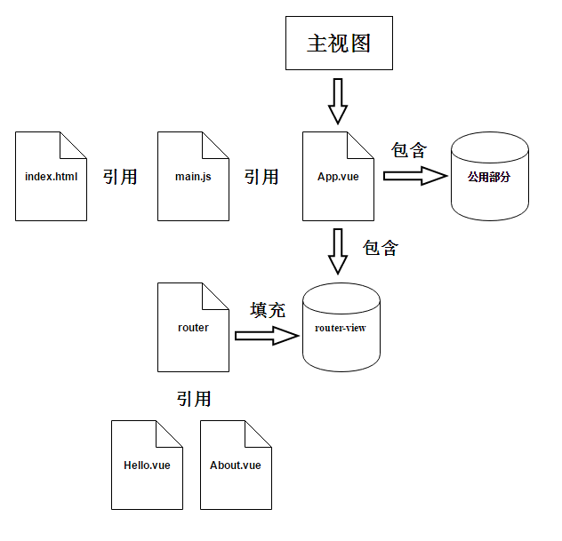

## vue介绍

### 目录结构

    package.json - 依赖信息
    config - 项目初始化配置
    build - webpack初始化配置
    index.html - 预设首页
    src目录 - 工程目录

入口类： build/webpack.base.conf.js类

    entry: {
      app: './src/main.js'
    }
    
### vuejs结构图

vuejs核心：组件+路由

## 教程
[包学会之浅入浅出Vue.js：开学篇](https://cloud.tencent.com/developer/article/1020337)  
[包学会之浅入浅出Vue.js：升学篇](https://cloud.tencent.com/developer/article/1020338)  
[包学会之浅入浅出Vue.js：结业篇](https://cloud.tencent.com/developer/article/1020416)  
